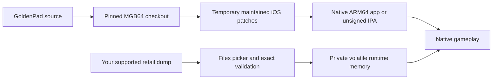

# GoldenPad

<p align="center">
  
</p>

<p align="center">
  <strong>GoldenEye 007, rebuilt as a native app for iPhone and iPad.</strong><br>
  Apple ARM64 game code, Metal rendering, user-supplied retail data, touch
  controls, game controllers, saves, audio, and local multiplayer foundations.
</p>

<p align="center">
  
  
  
  
  
</p>

GoldenPad is a native iOS/iPadOS integration of the reconstructed GoldenEye 007
game code from [MGB64](https://github.com/akratch/mgb64). It is not a general
Nintendo 64 emulator and it does not contain the game, a ROM, or extracted game
assets. A supported, legally acquired retail dump is selected locally through
Files and retained only in private volatile memory while the game runs.

The current build reaches the original title sequence, menus, and missions on
iPhone and iPad Simulator through MGB64's Fast3D Metal renderer. It has native
audio, persistent EEPROM saves, modern and classic touch layouts, physical
controller support, controller assignment for Players 1–4, and a reproducible
ROM-free unsigned IPA build.

## Install status

| Option | Status | What to do |
|---|---|---|
| Local Simulator build | **Verified** | Build with the complete verifier below, then run from Xcode or `simctl`. |
| Local iPhone/iPad build | **Builds for ARM64** | Configure signing with your Apple development team and install from Xcode. |
| Unsigned `.ipa` | **Buildable locally** | Run `scripts/package-unsigned-ipa.sh`, then re-sign the result for your own device. |
| GitHub release | **Not published** | No downloadable GoldenPad IPA is currently advertised. |
| App Store / TestFlight | **Not announced** | Store distribution requires separate rights, signing, review, and device acceptance. |

Simulator gameplay and UI are extensively exercised. A final signed physical
iPhone/iPad pass is still required for touch feel, sustained performance,
speaker and route behavior, controller hardware, thermals, and lifecycle
acceptance. The developer preview should not be described as an App Store-ready
release.

## What works

| Area | Current result |
|---|---|
| Native runtime | MGB64 game code links and runs as Apple ARM64; no emulator wrapper |
| Rendering | Native Fast3D path presents through Metal on iPhone and iPad |
| Setup | Files picker validates the supported US retail revision and starts the game |
| Gameplay | Original front end and live Dam/Facility gameplay render and accept normal input |
| Touch | Modern, Southpaw, and complete N64 layouts with independent phone/tablet profiles |
| Customization | Global opacity/size plus per-control move, resize, hide/show, and reset |
| Controllers | `GCController`, isolated face-button mapping, four visible player assignments |
| Multiplayer | Native desktop split-screen baseline and touch + Player 2 gamepad preparation path |
| Audio | MGB64 sequence/SFX synthesis feeds `AVAudioEngine` through a bounded PCM ring |
| Saves | 2 KiB EEPROM restores and persists atomically in Application Support |
| Display | Persisted 1×, 2×, 3×, and 4× scene resolution plus an opt-in game-FPS HUD |
| Packaging | ROM-free unsigned ARM64 IPA with source-license and third-party-notice audits |

See [Status](docs/STATUS.md) and [Testing](docs/TESTING.md) for the evidence
ledger and the remaining physical-device gates.

## Get started

You need:

- an Apple Silicon Mac with Xcode and its command-line tools;
- CMake 3.28 or newer and Git;
- an Apple development team for a signed physical-device build; and
- your own legally acquired supported US retail GoldenEye 007 N64 dump.

Clone and build the complete native game/Metal closure:

```sh
git clone https://github.com/chrissotraidis/goldenpad.git
cd goldenpad

./scripts/verify-mgb64-ios-renderer.sh
```

The verifier fetches the exact pinned MGB64 source, applies GoldenPad's narrow
mobile patches temporarily, builds Release apps for Simulator and device, checks
the linked game/Metal/audio symbols, rejects desktop renderer dependencies, and
leaves the upstream checkout clean.

The resulting apps are written to:

```text
build-mgb64-renderer-simulator/Release-iphonesimulator/GoldenPad.app
build-mgb64-renderer-device/Release-iphoneos/GoldenPad.app
```

For signing, Simulator destinations, and the maintained RT64 reference path,
see [Building](docs/BUILDING.md).

## First launch

GoldenPad never downloads or bundles game data.

1. Launch GoldenPad.
2. Select **Select retail ROM**.
3. Choose your supported `.z64`, `.v64`, `.n64`, or `.rom` file in Files.
4. Wait for exact size, header, title, byte-order, and SHA-1 validation.
5. The setup shell yields to the original game once the private runtime handoff
   and native scheduler are ready.

The source file is not copied into the app bundle, IPA, repository, or a
publishable cache. GoldenPad closes the Files security scope after validation
and keeps normalized retail bytes in core-owned volatile memory.

## Touch controls

GoldenPad defaults to a modern dual-stick FPS layout:

| Control | Behavior |
|---|---|
| **MOVE** | Large left virtual stick |
| **LOOK** | Relative right-thumb swipe region; movement stops when the swipe stops |
| **FIRE** | N64 Z / primary fire |
| **AIM** | N64 R; Toggle by default, with Hold available |
| **ACTION** | Contextual N64 B for doors, use, and reload |
| **WEAPON** | N64 A weapon cycle / confirm |
| **DUCK** | C-down crouch |
| **PAUSE** | Start / watch and menus |

Open the persistent gear button and choose **Touch Controls** to adjust:

- look sensitivity;
- Toggle or Hold aim behavior;
- gyroscope aiming;
- overlay opacity and global control size;
- controller auto-hide; and
- the separate iPhone or iPad touch layout.

Choose **Edit touch layout**, tap a control, and drag it to a comfortable
position. The selected control can be resized from 70–150% and hidden or shown;
MOVE cannot be hidden. **Reset** restores the selected device class and preset
to its defaults. Only changed placements are stored, so phone, tablet, Modern,
Southpaw, and N64 layouts remain independent.

The revised phone defaults keep WEAPON/DUCK above the home-indicator strip and
the action rail clear of rounded edges. LOOK accumulates every swipe delta until
the renderer samples it, preventing fast movement from being silently dropped.
These fixes are Simulator-verified; final sensitivity and placement still need
real-finger acceptance on physical hardware.

## Controllers and multiplayer

Open **Game Settings → Physical Controllers** to see Players 1–4. Touch always
belongs to Player 1. A connected controller can be moved to any slot, and moving
into an occupied slot swaps the two controllers.

For two-player touch + gamepad play, move the gamepad to Player 2. The settings
page shows a green readiness confirmation, and the original GoldenEye
**Multiplayer** menu becomes available once the game sees two connected players.
Native split-screen startup is proven, but a complete human-played mobile match
remains an open acceptance gate.

## Resolution and performance

Open **Game Settings → Display** to choose the scene render scale:

| Setting | iPhone 16 Pro target | iPad Pro 11-inch target | Intended use |
|---|---:|---:|---|
| **1×** | 874×402 | 1210×834 | Performance-first default |
| **2×** | 1748×804 | 2420×1668 | Sharper scene rendering |
| **3×** | 2622×1206 | 3630×2502 | High supersampling |
| **4×** | 3496×1608 | 4840×3336 | Maximum quality; 16× the pixels of 1× |

Only the game scene scales; native SwiftUI controls remain at display
resolution. Higher levels are optional supersampling, not a frame-rate promise.
The opt-in Performance HUD reports actual MGB64 game display-list submissions,
frame time, and 1% low rather than the device's 60 Hz UI callback rate.

## Reproducible and ROM-free



The compile and package steps never read your ROM. To produce the complete
unsigned developer artifact:

```sh
./scripts/verify-mgb64-ios-renderer.sh
./scripts/verify-source-license-manifest.sh
./scripts/package-unsigned-ipa.sh
./scripts/verify-unsigned-ipa.sh --game-core \
  dist/GoldenPad-0.1.0-unsigned.ipa
```

The package audit requires ARM64, no signature or provisioning profile, MGB64's
game entry point, native Metal/Fast3D entry points, third-party notices, no
private checkout paths, and no ROM headers, hashes, filenames, or extracted
media. Exact current hashes and clean-checkout reproduction evidence live in
[Testing](docs/TESTING.md).

## Current limitations

- Signed physical-iPhone/iPad touch, audio-route, controller, lifecycle,
  performance, and thermal acceptance is not complete on this Mac.
- Human touch-only mission completion and human-completed local multiplayer
  remain open.
- Scene cadence is workload-dependent, especially in Simulator and at 3×/4×.
- GoldenRecomp remains a reference because its public generated-input pipeline
  cannot currently be reproduced; MGB64 is the selected production core.
- This source-available developer preview is not an official or commercially
  licensed GoldenEye distribution.

## Frequently asked questions

<details>
<summary><strong>Does this repository contain GoldenEye 007?</strong></summary>

No. It contains mobile integration code, maintained patches, build scripts, and
documentation. You must supply your own legally acquired supported retail dump.
Do not open issues requesting game data or download links.
</details>

<details>
<summary><strong>Is GoldenPad an N64 emulator?</strong></summary>

No. Reconstructed GoldenEye game code is compiled into a native Apple ARM64
application. The selected Fast3D path renders through Metal.
</details>

<details>
<summary><strong>Where is the IPA?</strong></summary>

There is no advertised public release asset yet. The repository can build a
ROM-free unsigned IPA locally. It must be re-signed for your own device and
still requires your own retail dump after installation.
</details>

<details>
<summary><strong>Will 4× make the game run faster?</strong></summary>

No. It makes the game scene sharper by drawing sixteen times as many pixels as
1×. Start at 1× and raise the setting only when your device has performance
headroom.
</details>

<details>
<summary><strong>Is this legally cleared for the App Store?</strong></summary>

No claim of official, commercial, or App Store clearance is made. User-supplied
retail data keeps ROM media out of the repository and IPA, but it does not erase
the separate rights questions around reconstructed game code. Read the
[Legal and provenance policy](docs/LEGAL.md).
</details>

## Project map

| Path | Purpose |
|---|---|
| [`Sources/`](Sources/) | Native SwiftUI, Metal host, input, audio/save services, and ROM validation |
| [`Support/MGB64/`](Support/MGB64/) | Thin SDL-free Apple adapters around the pinned portable core |
| [`patches/`](patches/) | Maintained, reversible MGB64 and renderer changes |
| [`scripts/`](scripts/) | Fetch, build, test, audit, and unsigned-IPA packaging gates |
| [`docs/PLAN.md`](docs/PLAN.md) | Milestones and definition-of-done gates |
| [`docs/STATUS.md`](docs/STATUS.md) | Current evidence and remaining work |
| [`docs/ARCHITECTURE.md`](docs/ARCHITECTURE.md) | Portable core and thin Apple platform design |
| [`docs/RESEARCH.md`](docs/RESEARCH.md) | Pinned upstreams and production-core decision |
| [`docs/BUILDING.md`](docs/BUILDING.md) | Full local build and signing workflow |
| [`docs/TESTING.md`](docs/TESTING.md) | Reproducible verification procedures and hashes |
| [`docs/LEGAL.md`](docs/LEGAL.md) | ROM, source, licensing, and distribution boundary |
| [`docs/ART.md`](docs/ART.md) | Original app-icon provenance |
| [`docs/WORKLOG.md`](docs/WORKLOG.md) | Chronological production log |

Generated source trees, build directories, ROMs, saves, signing material, and
release artifacts are ignored and must never be committed.

## Legal and acknowledgements

GoldenPad is an unofficial preservation and research project. It is not
affiliated with or endorsed by Nintendo, Rare, Microsoft, MGM, Danjaq, EON
Productions, or any other rights holder. GoldenEye 007 and all related names,
characters, imagery, and game content belong to their respective owners.

GoldenPad builds on MGB64, the GoldenEye decompilation community, n64-fast3d,
Metal support work, and their contributors. Each upstream component retains its
own copyright and license. No ROM, extracted game media, leaked XBLA material,
or proprietary matching-target SDK implementation source is included here.
