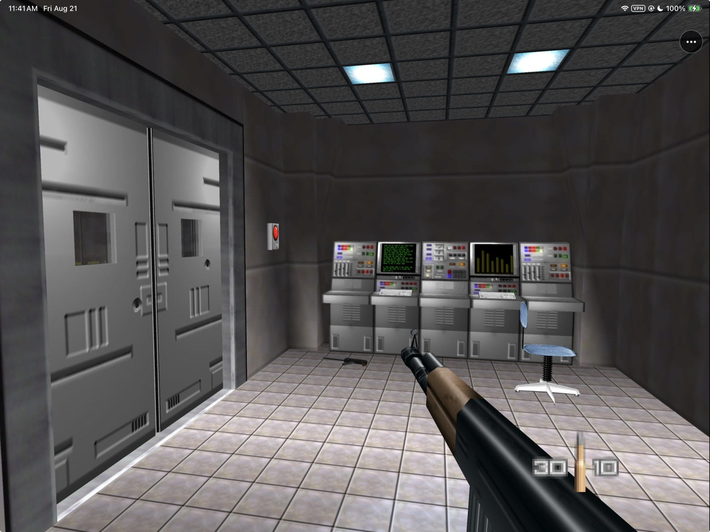
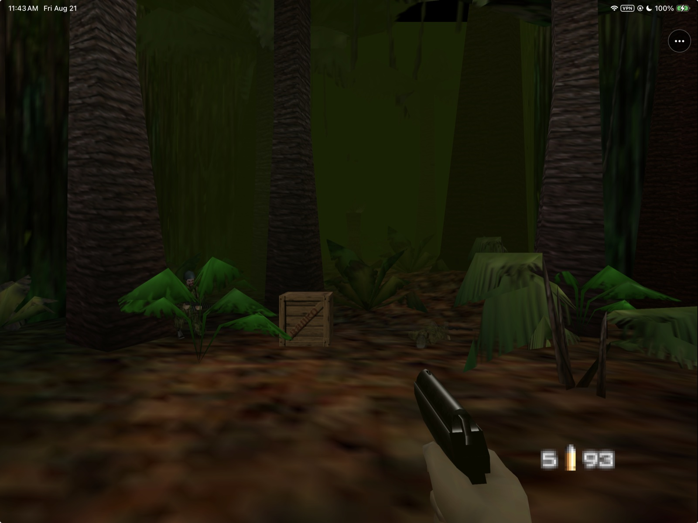
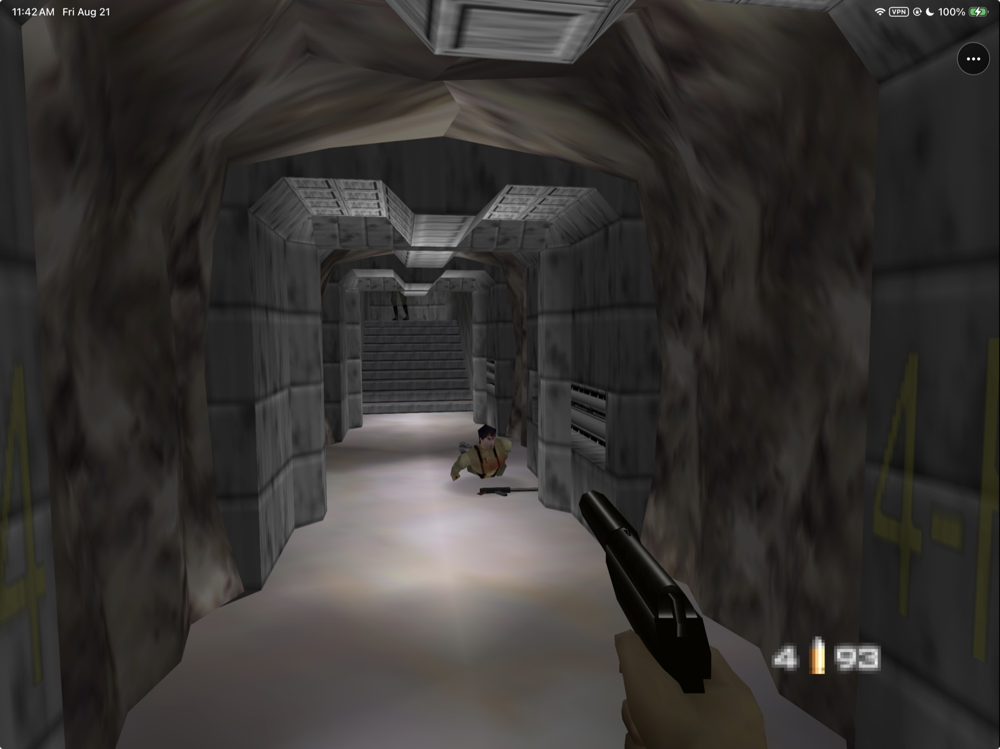
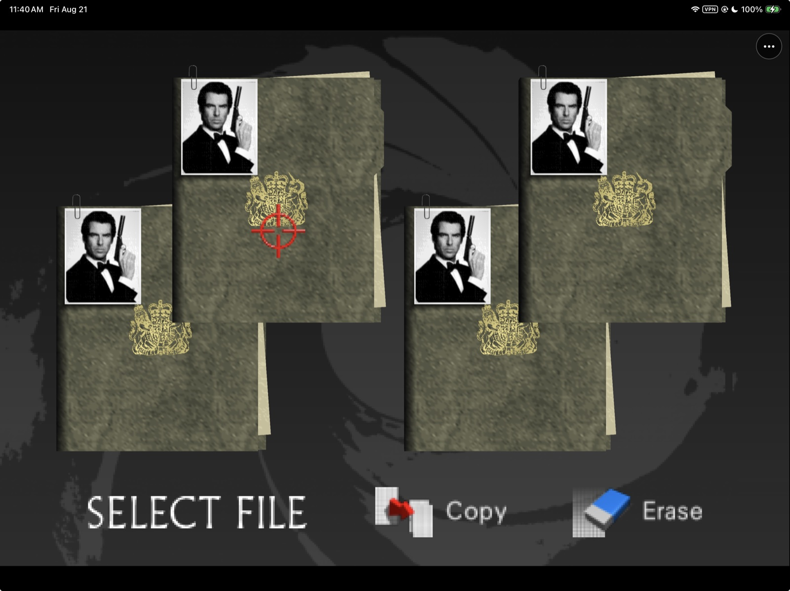

# GoldenPad

<p align="center">
  
</p>

<p align="center">
  <strong>GoldenEye 007, rebuilt for iPhone, iPad, and Apple Silicon Mac.</strong><br>
  Apple ARM64 game code, Metal rendering, user-supplied retail data, touch
  controls, game controllers, saves, audio, and local multiplayer foundations.
</p>

<p align="center">
  
  
  
  
  
  
</p>

<p align="center">
  
</p>
<p align="center"><em>Native RT64/Metal gameplay on a physical iPad Pro.</em></p>

GoldenPad's primary iPhone/iPad runtime uses statically recompiled GoldenEye 007
code, N64ModernRuntime and RT64's Metal renderer. It is not a general Nintendo
64 emulator and it does not contain the game, a ROM, or extracted game assets.
The supported retail data remains user-supplied and private.

The same runtime now has a native Apple-Silicon `GoldenPad.app` in alpha. It
reaches authentic gameplay, but its mouse/keyboard experience and performance
remain below the accepted mobile builds, and a thin blue strip remains at the
far-right render edge. See the
[Mac feasibility and implementation record](docs/MACOS_NATIVE_FEASIBILITY_2026-08-21.md)
and [Technical Debt](docs/TECH_DEBT.md) before treating it as release parity.

The primary RT64 build reaches the original title sequence, menus and multiple
missions on a physical iPad with native audio, the tuned GoldenPad touch layout
and Xbox/MFi controller support. The earlier MGB64/Fast3D app is retained as
`GoldenPad Legacy` for regression comparison and fallback only; it is no longer
the primary development version.

> **Development boundary:** generated AOT source and retail-derived data are
> never committed. GoldenPad preview artifacts distribute a compiled runtime
> only; they contain
> no ROM, save, extracted retail media, provisioning profile, or signing
> identity. No official, commercial, or App Store clearance is claimed.

## Play on iPhone or iPad

You need an iPhone or iPad running iOS/iPadOS 17 or later, a Mac or Windows
computer, an Apple ID, and your own original US GoldenEye 007 Nintendo 64 ROM.

> **No jailbreak or JIT is required. Do not search for a TLB-free ROM.**
> Preview 2 accepts your ordinary `.z64`, `.v64`, `.n64`, or `.rom` dump and
> prepares the required private runtime copy automatically on the device.

1. Install **AltStore Classic** by following its official
   [macOS guide](https://faq.altstore.io/altstore-classic/how-to-install-altstore-macos)
   or [Windows guide](https://faq.altstore.io/altstore-classic/how-to-install-altstore-windows).
   Use AltStore Classic with AltServer, not AltStore PAL. PAL cannot install an
   arbitrary unsigned `.ipa` downloaded from GitHub.
2. Download
   [`GoldenPad-0.1.0-preview.2-unsigned.ipa`](https://github.com/chrissotraidis/goldenpad/releases/download/v0.1.0-preview.2/GoldenPad-0.1.0-preview.2-unsigned.ipa).
   This is the iPhone/iPad app. Do not download the separate Mac `.zip`.
3. Open AltStore Classic on the device, go to **My Apps**, tap **+**, and choose
   the downloaded GoldenPad `.ipa` from Files. Follow iOS's prompts to trust
   your Apple ID and enable Developer Mode if required.
4. Launch GoldenPad, tap **Choose GoldenEye 007 ROM**, and select your own
   original US retail dump from Files. Other regions and revisions are not
   interchangeable with the supported release.
5. Keep GoldenPad open while it verifies and prepares the game. The title
   sequence starts automatically when setup finishes.

Apps signed through AltStore Classic with a free Apple ID normally need to be
refreshed every seven days and count toward Apple's three-active-app limit.
AltStore documents the current limits and refresh process in its
[Getting Started guide](https://faq.altstore.io/altstore-classic/your-altstore).
Install future GoldenPad updates through the same sideloading setup. Do not
delete the app merely to update it: uninstalling can remove its generated game
copy, saves, and settings.

If any step fails, use [the troubleshooting checklist](#if-it-does-not-work)
before reporting that GoldenPad itself does not work.

## Current screenshots

<table>
  <tr>
    <td width="50%"></td>
    <td width="50%"></td>
  </tr>
  <tr>
    <td align="center"><strong>Jungle</strong><br>Automatic high resolution with RT64 Metal.</td>
    <td align="center"><strong>Live gameplay</strong><br>Native ARM64 game code and controller input.</td>
  </tr>
  <tr>
    <td colspan="2"></td>
  </tr>
  <tr>
    <td colspan="2" align="center"><strong>Original front end</strong><br>GoldenEye menus, saves, missions, and gameplay run in the primary RT64 build.</td>
  </tr>
</table>

These user-approved captures were taken from the signed GoldenPad build on a
physical iPad. No ROM, save, extracted asset file, or game data is included in
the repository or application package.

## Install status

| Option | Status | What to do |
|---|---|---|
| Local Simulator build | **Verified** | Build with the complete verifier below, then run from Xcode or `simctl`. |
| Local iPhone/iPad build | **Physically approved Preview 2** | The exact release build is installed on both devices with their ROMs, saves and preferences preserved, and the user approved it for publication after hands-on review. |
| Native Apple-Silicon Mac build | **Official project Alpha** | GoldenPad officially supports Apple Silicon Macs in Alpha status. [Download the separate arm64 Mac Alpha](https://github.com/chrissotraidis/goldenpad/releases/download/v0.1.0-preview.2/GoldenPad-0.1.0-preview.2-macos-arm64-alpha.zip); mouse tuning, the thin far-right blue edge and sustained performance remain open. |
| Unsigned `.ipa` | **Audited Preview 2** | Follow [Play on iPhone or iPad](#play-on-iphone-or-ipad) to install the public unsigned IPA with AltStore Classic. |
| GitHub release | **Preview 2** | [Release notes, downloads and SHA-256](https://github.com/chrissotraidis/goldenpad/releases/tag/v0.1.0-preview.2). |
| App Store / TestFlight | **Not announced** | Store distribution requires separate rights, signing, review, and device acceptance. |

The mobile baseline was accepted through normal single-player gameplay on a
physical iPhone and iPad, including the editable touch layout and Xbox/MFi
controller path. Preview 2 adds the bounded in-app ROM importer and the frozen
experimental multiplayer render repair. The exact final rebuild was approved
for publication after hands-on review. Longer thermal/route sweeps and complete
multiplayer acceptance remain open. This developer preview must not be
described as App Store-ready.

The Mac app is a separate alpha artifact, not part of the `.ipa` and not yet a
mobile-parity or notarized Mac release.

## What works

| Area | Current result |
|---|---|
| Native runtime | Statically recompiled game code runs as Apple ARM64; no JIT or emulator wrapper |
| Rendering | RT64 presents high-resolution Metal output on physical iPad hardware |
| Setup | Preview 2 imports the user's original NTSC-U retail dump from Files and converts it privately on device; no game data is included |
| Gameplay | Original front end and live Dam/Facility gameplay render and accept normal input |
| Touch | Tuned GoldenPad move and relative-look zones plus aim, fire, action, weapon, duck, and Start controls |
| Customization | Separate persisted iPhone/iPad layouts with per-control drag, resize, opacity and reset, plus look sensitivity and hold/toggle aim |
| Controllers | `GCController` with accepted Player 1 movement, right-stick look, buttons, and automatic touch-overlay hiding |
| Multiplayer | Experimental; the frozen Preview 2 render baseline removes the former large black/checkerboard corruption on physical iPad, while slight lighting flicker and real three/four-controller routing remain open |
| Audio | Native game PCM feeds `AVAudioEngine` through a bounded stereo ring |
| Saves | GoldenEye's 512-byte EEP4K active and backup files persist in Application Support |
| Display | Native N64, 2× and automatic high-resolution modes, 2× MSAA and N64 three-point filtering |
| macOS | Officially supported on Apple Silicon in Alpha status; native arm64 `GoldenPad.app` reaches gameplay with disclosed input, edge-rendering and performance debt |
| Legacy fallback | MGB64/Fast3D remains buildable as `GoldenPad Legacy` |

See [Status](docs/STATUS.md) and [Testing](docs/TESTING.md) for the evidence
ledger and remaining physical-device gates. [Technical debt and upstream
watch](docs/TECH_DEBT.md) records when decompilation, MGB64, and renderer changes
are safe to evaluate or adopt. The focused two-player repair and deferred local/
online enhancements are tracked in the [multiplayer roadmap](docs/MULTIPLAYER_ROADMAP.md).

## Supported game

| Game | Retail revision | Status |
|---|---|---|
| **GoldenEye 007** | Original US Nintendo 64 release | Supported after exact validation |
| Other regions or revisions | Any other dump | Rejected; not interchangeable with the supported build |
| GoldenEye XBLA | Leaked/unreleased Xbox 360 build | Prohibited and never used |

GoldenPad is a native integration of reconstructed N64 game code, not a general
emulator. Another N64 game or GoldenEye revision cannot be substituted.

## Release files and advanced setup

### Preview 2 downloads

Download
[`GoldenPad-0.1.0-preview.2-unsigned.ipa`](https://github.com/chrissotraidis/goldenpad/releases/download/v0.1.0-preview.2/GoldenPad-0.1.0-preview.2-unsigned.ipa)
and its adjacent `.sha256` file. The IPA is intentionally unsigned. Follow
[Play on iPhone or iPad](#play-on-iphone-or-ipad) for the supported AltStore
Classic installation path.

On first launch, choose your own original NTSC-U retail ROM from Files.
GoldenPad recognizes `.z64`, `.v64`, `.n64`, and `.rom` byte orders, performs
the required TLB-free transformation privately on the device, verifies the
exact output, and starts the native runtime automatically. A valid Preview 1
`GoldenEye_TLBFREE.z64` is reused unchanged during an in-place update. See the
[Preview 2 ROM import design and acceptance record](docs/PREVIEW_2_ROM_IMPORT.md).

The separate Apple-Silicon Mac Alpha is
[`GoldenPad-0.1.0-preview.2-macos-arm64-alpha.zip`](https://github.com/chrissotraidis/goldenpad/releases/download/v0.1.0-preview.2/GoldenPad-0.1.0-preview.2-macos-arm64-alpha.zip).
It is an ad-hoc-signed, non-notarized arm64 app and remains below mobile release
quality. It uses the same user-supplied-data boundary and must not be described
as mobile parity.

<details>
<summary><strong>Preview 1 manual setup (legacy only)</strong></summary>

> **Preview 2 users do not need these steps or a prebuilt TLB-free ROM.** This
> section is retained only for people intentionally running the older Preview 1
> artifact.

> **Using the IPA does not require building GoldenPad from source.** Install and
> re-sign the IPA, generate the required game-data file once from your own retail
> dump, copy it into the app, and launch. The conversion is not repeated on later
> launches.

Download
[`GoldenPad-0.1.0-preview.1-unsigned.ipa`](https://github.com/chrissotraidis/goldenpad/releases/download/v0.1.0-preview.1/GoldenPad-0.1.0-preview.1-unsigned.ipa)
and its adjacent `.sha256` file. The IPA is intentionally unsigned: re-sign it
with your own Apple development identity or install it through AltStore Classic,
then install it on iOS/iPadOS 17 or later.

GoldenPad does not include or download GoldenEye. Preview 1 expects a supported,
user-derived `GoldenEye_TLBFREE.z64` in the app's Documents folder. Use Finder
file sharing after installation to copy that file.

#### Create the required TLB-free file

Generate this file locally from your own legally acquired NTSC-U GoldenEye dump.
Do not download or request a converted ROM. Renaming a normal ROM does not work.

**Why is this necessary?** Preview 1's statically recompiled runtime was built
around a modified ROM memory layout that keeps the original TLB-mapped game code
resident in Expansion Pak memory and stores the original compressed data segment
uncompressed in the layout expected by the recompiled code. The unmodified retail
ROM has a different layout, so Preview 1 cannot read it directly. This is a
technical limitation of the current build, not a DRM check. The Preview 2
source now performs this same private conversion inside GoldenPad so users can
select their ordinary retail dump directly; Preview 1 still needs the manual
process below.

These commands require a big-endian `.z64` dump whose SHA-1 is
`abe01e4aeb033b6c0836819f549c791b26cfde83`. If your dump is `.v64` or `.n64`,
first convert its byte order to big-endian `.z64`, then verify the SHA-1:

```sh
shasum "/path/to/your/GoldenEye.z64"
```

On macOS, install `xdelta`, download the ROM-free conversion patch from the
exact [GoldenEye64Recomp revision used by GoldenPad](https://github.com/cblock85/GoldenEye64Recomp/tree/a787fe0d95e8278fcba5ba2d768fa6a606e75f55),
verify it, and apply it to your dump:

```sh
brew install xdelta

curl --fail --location --output vanilla_to_tlbfree.xdelta \
  https://raw.githubusercontent.com/cblock85/GoldenEye64Recomp/a787fe0d95e8278fcba5ba2d768fa6a606e75f55/vanilla_to_tlbfree.xdelta

echo "2942c16049c48a7bdb0ac0288bac21121847059f6f0b4e05343c0c1922a25b90  vanilla_to_tlbfree.xdelta" \
  | shasum -a 256 --check

xdelta3 -d -s "/path/to/your/GoldenEye.z64" \
  vanilla_to_tlbfree.xdelta \
  GoldenEye_TLBFREE.z64

shasum -a 256 GoldenEye_TLBFREE.z64
```

The generated file must report SHA-256
`7ec491ee3164851d0995e3e8ad19999df5e3028be6ba3729c4ac16c31a9c0959`.
The delta patch contains no complete ROM; conversion happens locally and the
retail input and generated output remain yours and must not be redistributed.

</details>

### Build from source

> **This is not required for IPA users.** The primary RT64/AOT app cannot
> currently be reproduced from the public checkout alone because its generated
> game-code inputs are private and intentionally untracked. The public build
> commands below produce the older `GoldenPad Legacy` fallback. To use the
> current primary release, follow **Preview 2** and **First launch** instead.

You need:

- an Apple Silicon Mac with Xcode and its command-line tools;
- [Homebrew](https://brew.sh), CMake 3.28 or newer, and Git;
- an Apple development team for a signed physical-device build; and
- your own legally acquired supported US retail GoldenEye 007 N64 dump.

Install CMake, then clone the repository:

```sh
brew install cmake
git clone https://github.com/chrissotraidis/goldenpad.git
cd goldenpad
```

The public repository contains the Apple integration and maintained patch chain.
The complete primary build additionally requires locally generated AOT inputs;
those generated sources and retail-derived inputs are ignored. The deprecated
legacy fallback remains reproducible from the public source tree:

```sh
./scripts/verify-mgb64-ios-renderer.sh
```

The verifier fetches the exact pinned MGB64 source, applies GoldenPad's narrow
mobile patches temporarily, builds Release apps for Simulator and device, checks
the linked game/Metal/audio symbols, rejects desktop renderer dependencies, and
leaves the upstream checkout clean.

The resulting apps are written to:

```text
build-mgb64-renderer-simulator/Release-iphonesimulator/GoldenPad.app
build-mgb64-renderer-device/Release-iphoneos/GoldenPad.app
```

For a physical device, add your Apple ID under **Xcode → Settings → Accounts**,
connect and trust the iPhone or iPad, then use your 10-character team ID and a bundle
identifier owned by that team:

```sh
GOLDENPAD_DEVELOPMENT_TEAM=ABCDE12345 \
GOLDENPAD_BUNDLE_IDENTIFIER=com.yourname.goldenpad \
  ./scripts/verify-mgb64-ios-renderer.sh

xcrun devicectl list devices
xcrun devicectl device install app \
  --device YOUR_DEVICE_ID \
  build-mgb64-renderer-device-signed/Release-iphoneos/GoldenPad.app
```

The signed build stays separate from the reproducible unsigned app. If Xcode
has not yet created an Apple Development certificate, use **Manage
Certificates** in the Accounts panel first. See [Building](docs/BUILDING.md)
for signing diagnostics, Simulator destinations, and the maintained RT64
reference path.

## First launch

GoldenPad never downloads or bundles game data.

1. Install the unsigned Preview 2 IPA by following
   [Play on iPhone or iPad](#play-on-iphone-or-ipad).
2. Launch GoldenPad and choose your own supported original NTSC-U retail ROM
   from Files. The importer accepts `.z64`, `.v64`, `.n64`, and `.rom` byte
   orders and validates the exact retail revision before conversion.
3. Keep GoldenPad open while it privately converts and verifies the runtime
   input. The original logos, front end, file selection and missions follow
   after the native runtime initializes.

The generated TLB-free runtime copy remains in GoldenPad's private Documents
container; the original file stays where you selected it. Neither file is in
the IPA, repository, release checksum, or diagnostics export. Removing the app
can remove its generated copy and saves, so preserve your original ROM and back
up important data before uninstalling.

## If it does not work

First identify the exact step that failed. Installation, ROM validation, and
the game runtime are separate stages with different fixes.

### The IPA will not install or open

- Confirm that you used **AltStore Classic with AltServer**, not AltStore PAL.
- Confirm that the device runs iOS/iPadOS 17 or later, Developer Mode is
  enabled, and the Apple ID profile is trusted when iOS requests it.
- With a free Apple ID, check the three-active-app limit and seven-day expiry in
  AltStore. Refresh or reinstall through the same AltStore setup rather than
  deleting GoldenPad.
- Record the complete AltStore or iOS error. If GoldenPad never launches, the
  failure happened before its ROM importer or game runtime ran.

### GoldenPad rejects the selected ROM

- Use your own original **US/NTSC-U GoldenEye 007** Nintendo 64 retail dump.
  PAL, Japanese, modified, overdumped, and other revisions are rejected.
- `.z64`, `.v64`, `.n64`, and `.rom` are accepted. Renaming another file or ROM
  does not change its contents and will not pass validation.
- Preview 2 performs the TLB-free conversion itself. Do not download, request,
  or manually create a TLB-free ROM for the current release.
- If GoldenPad cannot read a valid file from a cloud or third-party provider,
  copy it into **On My iPhone** or **On My iPad** in Files and try again.
  Keep enough free storage for GoldenPad's private prepared copy.

### The ROM is accepted but the game does not start

Fully quit and reopen GoldenPad once. If the app reaches its three-dot menu,
choose **Share Diagnostics & Logs** and keep the generated text file private
until you have checked it for personal information.

When filing a [GitHub issue](https://github.com/chrissotraidis/goldenpad/issues),
include:

- iPhone or iPad model and iOS/iPadOS version;
- GoldenPad release and build number;
- sideloading method and its exact error, if installation failed;
- the precise screen or action where progress stopped;
- the complete on-screen GoldenPad error;
- the ROM extension and stated region/revision, plus a checksum if available;
  and
- GoldenPad's diagnostics text if the app ran far enough to create it.

Never attach or link the ROM, generated game data, saves, Apple ID credentials,
certificates, or provisioning profiles.

## Touch controls

GoldenPad defaults to its current touch template, combining the original
GoldenEye movement semantics with modern relative look:

| Control | Behavior |
|---|---|
| **MOVE** | Large left virtual stick; forward/back and turn, with no sidestep in the current template |
| **LOOK** | Relative right-thumb swipe region; movement stops when the swipe stops |
| **FIRE** | N64 Z / primary fire |
| **AIM** | N64 R; Toggle by default, with Hold available |
| **ACTION** | Contextual N64 B for doors, use, and reload |
| **WEAPON** | N64 A weapon cycle / confirm |
| **DUCK** | C-down crouch |
| **START** | Start / watch and menus |

Open the three-dot menu and choose **Edit Touch Controls** to customize the
actual live overlay. The running game remains full size and the real three-dot
menu stays visible as a placement reference. The same editor is also available
through **Settings → Touch Controls**.

Touch Controls also contains:

- look sensitivity;
- Toggle or Hold aim behavior;
- the current iPhone or iPad touch layout.

The current touch template does not expose GoldenEye's native C-left/C-right
sidestep inputs. [Issue #8](https://github.com/chrissotraidis/goldenpad/issues/8)
tracks the verified modern-semantics repair: MOVE horizontal should strafe while
LOOK horizontal turns, with Original N64 C-buttons preserved as a separate
controller mode. This is an input-semantics change, not a touch-layout rewrite;
the accepted iPhone/iPad placement profiles remain regression controls.

In edit mode, drag a control directly over the running game. The selected
control receives a yellow outline and the always-visible top slider resizes it
from 55–160%; the opacity slider adjusts that selected control from 20–100%.
**Reset** restores the current device-class defaults, **Cancel** discards the
draft, and **Done** saves it. Button labels stay on one line and scale down with
smaller controls. Phone and tablet layouts use separate persisted profiles.

The phone defaults are the physically accepted iPhone 14 layout: MOVE remains
inside the left edge, LOOK clears the action rail, and AIM/FIRE/ACTION plus
WEAPON/DUCK fit above the bottom edge at the established 72% opacity. LOOK
preserves GoldenPad's tuned relative swipe accumulation. iPad keeps its separate
accepted tablet profile.

## Controllers and multiplayer

The primary build automatically uses the first Xbox/MFi extended gamepad for
Player 1 and hides the touch overlay while it is connected. Movement, modern
right-stick look, aim, fire, action, weapon, crouch and Start are physically
accepted. **Settings → Controller → Right stick → Original N64 C-buttons**
restores GoldenEye's native C-left/C-right sidestep input, but replaces modern
analog right-stick look with the original C-button behavior. **Settings →
Controller → Button mapping** can reassign the face
buttons, bumpers, and triggers; sticks, D-pad, and Menu/Start retain their
standard roles. For hardware-limited testing, **Cheats & Testing → Two-player input
test** keeps the attached controller as Player 1 and exposes touch controls as
Player 2. Turning it off hides touch and keeps the controller as Player 1. The
former multiplayer process crash and large split-screen corruption have
targeted repairs. A physical four-player render test kept all quadrants coherent
without the former black/checkerboard failure, but slight lighting flicker and
real Player 3/4 controller routing remain open. Treat multiplayer as an
experimental Preview 2 path, not a fully accepted feature.

The primary host does not yet support peer-to-peer or online multiplayer. It
binds one real controller; the additional ports above are diagnostics, not a
network or production four-controller layer. The staged local-ownership,
determinism, LAN, and internet gates are documented in the
[multiplayer roadmap](docs/MULTIPLAYER_ROADMAP.md).

## Resolution and performance

Open the three-dot menu and choose **Settings** to select Native N64, 2× or
Automatic high resolution, plus 2× MSAA and N64 three-point filtering. These
settings are saved immediately and apply after quitting and reopening GoldenPad;
the active RT64 session is not rebuilt in place. They alter how the original
ROM assets are rendered; no HD texture pack is bundled. To restore the original
N64 look, select Native N64, disable both 2× anti-aliasing and three-point
filtering, then fully quit and reopen the app.

**Cheats & Testing → Unlock all missions** defaults to **Off** on a clean
install. It is a testing convenience only and any explicit user choice is
preserved during an in-place update.

## Reproducible and ROM-free

The primary integration, dependency pins and reversible patches are public.
Retail data, converted ROM derivatives and generated AOT game sources remain
private and ignored. `scripts/package-recomp-prototype-ipa.sh` strips the
developer signature/provisioning profile, adds the applicable dependency
licenses, and invokes `scripts/verify-recomp-prototype-ipa.sh`; that verifier
rejects ROM/save/signing members, N64 ROM headers, private user paths and legacy
MGB64 symbols. The older MGB64 IPA workflow remains a fallback only.

## Current limitations

- Automatic player/guard weapon cadence is not yet timing-authentic at the
  primary runtime's native 60 Hz. A deterministic measurement gate is required
  before changing the accepted combat feel.
- Modern MOVE horizontal input does not yet provide modern-FPS sidestep
  semantics. Original N64 C-button mode can restore sidestep on a physical
  controller, but touch remains affected ([issue #8](https://github.com/chrissotraidis/goldenpad/issues/8)).
- A deterministic first-frame RT64/Metal crash is reported on an A12X iPad Pro
  with Preview 1. A12-family hardware is not yet validated; the compatibility
  fix or minimum GPU policy remains open ([issue #9](https://github.com/chrissotraidis/goldenpad/issues/9)).
- Multiplayer has a stable experimental render baseline, not final acceptance.
  Slight lighting flicker and real three/four-controller routing remain open.
- Peer-to-peer, LAN, internet, relay, and rollback multiplayer are not
  implemented.
- Preview 2's in-app retail-ROM conversion is complete and package-audited.
  A clean physical-iPhone installation has reached the empty-container setup
  screen; fresh real-ROM import, wrong-ROM, cancellation and low-storage
  coverage remains open in the focused importer acceptance record.
- Some stage-specific geometry glitches remain to be captured precisely.
- Occasional audio static and multi-controller play remain open quality work.
- The generated-input pipeline is not independently reproducible from the
  public repository; private retail-derived inputs are never distributed.
- This source-available developer preview is not an official or commercially
  licensed GoldenEye distribution.

## Frequently asked questions

<details>
<summary><strong>Does this repository contain GoldenEye 007?</strong></summary>

No. It contains mobile integration code, maintained patches, build scripts, and
documentation. You must supply your own legally acquired supported retail dump.
Do not open issues requesting game data or download links.
</details>

<details>
<summary><strong>Is GoldenPad an N64 emulator?</strong></summary>

No. Statically recompiled GoldenEye code runs as a native Apple ARM64
application, and RT64 renders through Metal. The separate MGB64/Fast3D app is
retained only as the deprecated legacy fallback.
</details>

<details>
<summary><strong>Where is the IPA?</strong></summary>

Preview 2 is available from the
[GitHub release](https://github.com/chrissotraidis/goldenpad/releases/tag/v0.1.0-preview.2).
It is an unsigned, ROM-free developer-preview IPA and must be re-signed. It does
not include game data; follow [Play on iPhone or iPad](#play-on-iphone-or-ipad)
for installation and first-launch instructions.
</details>

<details>
<summary><strong>Do I need JIT or a TLB-free ROM?</strong></summary>

No. GoldenPad's game code is compiled ahead of time, so the iPhone/iPad release
does not need JIT. Preview 2 accepts the supported original US retail dump and
creates the required TLB-free runtime copy privately on the device. Do not use
the old Preview 1 manual conversion instructions for Preview 2.
</details>

<details>
<summary><strong>Why will the IPA not install through AltStore PAL?</strong></summary>

AltStore PAL is a separate notarized marketplace channel and cannot install an
arbitrary unsigned IPA from GitHub. Use AltStore Classic with AltServer on a
Mac or Windows computer, as described in
[Play on iPhone or iPad](#play-on-iphone-or-ipad).
</details>

<details>
<summary><strong>Do the high-resolution settings make the game run faster?</strong></summary>

No. Native N64, 2× and Automatic high resolution change render quality, not game
speed. Higher internal resolution and 2× anti-aliasing can cost performance;
changes apply after fully quitting and reopening GoldenPad.
</details>

<details>
<summary><strong>Is this legally cleared for the App Store?</strong></summary>

No claim of official, commercial, or App Store clearance is made. User-supplied
retail data keeps ROM media out of the repository and IPA, but it does not erase
the separate rights questions around reconstructed game code. Read the
[Legal and provenance policy](docs/LEGAL.md).
</details>

<details>
<summary><strong>What is the licensing status?</strong></summary>

GoldenPad is source-available, but this repository currently has no top-level
outbound license grant. MGB64-authored port code and third-party libraries keep
their respective licenses; reconstructed original-game code remains subject to
the rights boundary described in [Source licenses](docs/SOURCE_LICENSES.md) and
[Legal](docs/LEGAL.md). Do not infer commercial or redistribution rights from
the repository being publicly readable.
</details>

## Project map

For engineering work, read in this order: **Status → Technical Debt → Plan →
Testing**. Architecture and the multiplayer roadmap provide subsystem-specific
constraints. Historical handoffs and worklogs preserve evidence but do not
override those current authority documents.

| Path | Purpose |
|---|---|
| [`Sources/`](Sources/) | Native SwiftUI, Metal host, input, audio/save services, and ROM validation |
| [`Support/RecompPrototype/`](Support/RecompPrototype/) | Primary AOT runtime, RT64, diagnostics and Apple bridges |
| [`Support/MGB64/`](Support/MGB64/) | Deprecated legacy fallback adapters |
| [`patches/`](patches/) | Maintained, reversible recomp, RT64 and legacy changes |
| [`scripts/`](scripts/) | Fetch, build, test, audit, and unsigned-IPA packaging gates |
| [`docs/PLAN.md`](docs/PLAN.md) | Current repair order, parallel evidence lanes, stop rules, and historical milestones |
| [`docs/NEXT_STEPS.md`](docs/NEXT_STEPS.md) | Short operational queue for the next implementation sessions |
| [`docs/STATUS.md`](docs/STATUS.md) | Current product truth, evidence, and immediate gates |
| [`docs/TECH_DEBT.md`](docs/TECH_DEBT.md) | Authoritative evidence-ranked defect, priority, repair, and upstream-watch ledger |
| [`docs/ARCHITECTURE.md`](docs/ARCHITECTURE.md) | Shipped AOT/RT64 architecture, ownership boundaries, and Legacy separation |
| [`docs/RESEARCH.md`](docs/RESEARCH.md) | Pinned upstreams and production-core decision |
| [`docs/BUILDING.md`](docs/BUILDING.md) | Full local build and signing workflow |
| [`docs/TESTING.md`](docs/TESTING.md) | Reproducible verification procedures and hashes |
| [`docs/RELEASE_CHECKLIST.md`](docs/RELEASE_CHECKLIST.md) | Clean-checkout, package, signing, and publication gates |
| [`docs/RELEASE_NOTES_0.1.0-preview.2.md`](docs/RELEASE_NOTES_0.1.0-preview.2.md) | Preview 2 downloads, checksums, changes and disclosed limitations |
| [`docs/MULTIPLAYER_ROADMAP.md`](docs/MULTIPLAYER_ROADMAP.md) | Local ownership, determinism, LAN research, network feasibility, and go/no-go gates |
| [`docs/EXTERNAL_TECHNICAL_REVIEW_HANDOFF.md`](docs/EXTERNAL_TECHNICAL_REVIEW_HANDOFF.md) | Read-only expert-review prompt for confidence-ranked analysis of the hardest remaining defects |
| [`docs/MACOS_NATIVE_FEASIBILITY_2026-08-21.md`](docs/MACOS_NATIVE_FEASIBILITY_2026-08-21.md) | Native Mac architecture, evidence and Alpha boundary |
| [`docs/LEGAL.md`](docs/LEGAL.md) | ROM, source, licensing, and distribution boundary |
| [`docs/SOURCE_LICENSES.md`](docs/SOURCE_LICENSES.md) | Separate primary-runtime and MGB64 Legacy source/license boundaries |
| [`docs/ART.md`](docs/ART.md) | Original app-icon provenance |
| [`docs/WORKLOG.md`](docs/WORKLOG.md) | Chronological production log |

Generated source trees, build directories, ROMs, saves, signing material, and
release artifacts are ignored and must never be committed.

## Contributing and support

Read [Contributing](CONTRIBUTING.md) before proposing a change and
[Security](SECURITY.md) before reporting a vulnerability. Reproducible platform
or gameplay defects can be filed through
[GitHub Issues](https://github.com/chrissotraidis/goldenpad/issues). Never attach,
request, or link to ROMs, extracted assets, leaked builds, saves containing
private data, signing identities, or provisioning profiles.

## Legal and acknowledgements

GoldenPad is an unofficial preservation and research project. It is not
affiliated with or endorsed by Nintendo, Rare, Microsoft, MGM, Danjaq, EON
Productions, or any other rights holder. GoldenEye 007 and all related names,
characters, imagery, and game content belong to their respective owners.

GoldenPad builds on GoldenEye64Recomp, N64Recomp, N64ModernRuntime, RT64, MGB64,
the GoldenEye decompilation community, Metal support work, and their
contributors. Each upstream component retains its own copyright and license.
No ROM, extracted game media, leaked XBLA material, or proprietary
matching-target SDK implementation source is included here.
